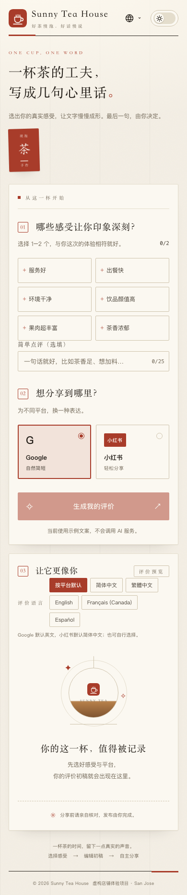
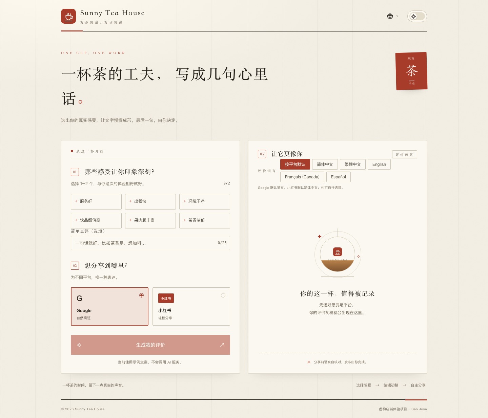
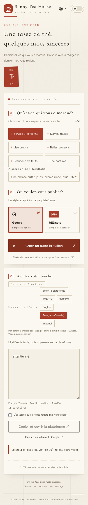
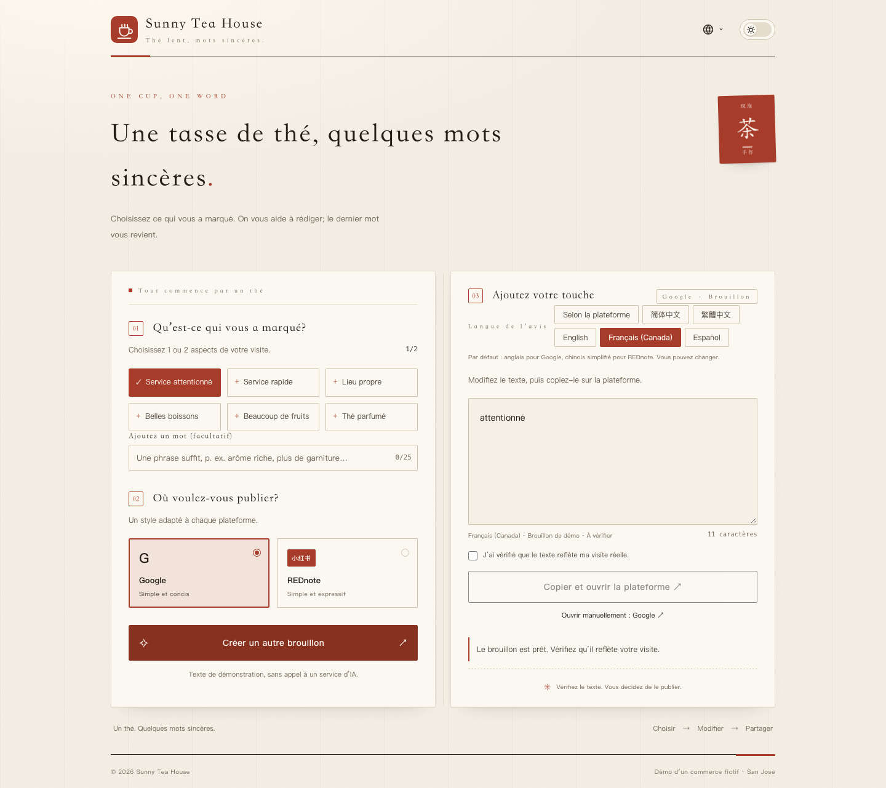
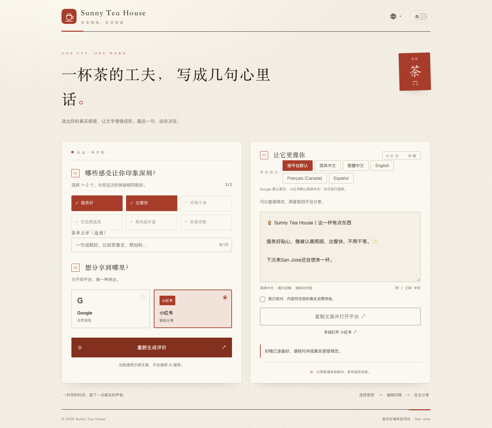
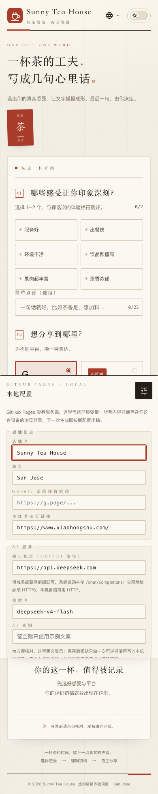

# Sunny Tea House 任务交付文档

## 一、交付内容

| 交付物 | 地址/位置 |
| --- | --- |
| 在线演示（Demo） | https://tyza66.github.io/sunny-tea-house/ |
| 项目仓库 | https://github.com/tyza66/sunny-tea-house |
| 项目文档 | 本目录 `docs/*.md` 与仓库 `README.md`，PDF 版见 `docs/交付文档.pdf` |

在线演示由 GitHub Pages 静态托管。没有服务端接口时页面自动回退本地示例文案，保证“选择感受 → 选择平台 → 生成 → 编辑 → 复制并跳转”闭环在手机浏览器可直接跑通；评审者也可以点右下角「本地设置」，填任意 OpenAI 兼容接口地址、模型名与自己的密钥，由浏览器直连该服务商获得真实 AI 初稿——密钥不过本站服务器。店家侧的真实 AI 模式由服务端读取环境变量，接口与模型名整体可替换，配置方式见 README 第 3 节与《AI 服务商接入》。

## 二、Demo 交互闭环

1. **感受选择**：6 个感受标签，最多选 2 个，前端与后端双重校验；另有选填的简单点评，25 字以内，会作为顾客原话进入生成。
2. **平台选择**：Google 与小红书两个平台，另有独立于界面的评价语言选择。
3. **AI 智能生成**：Google 输出自然的北美英语评论；小红书输出中文“种草笔记”风格，带 Emoji 与分段。真实模式调用所配置的 AI 服务商，演示模式使用本地模板并明确标注。
4. **编辑与流转**：textarea 可二次编辑；勾选“确认真实体验”后一键复制，并同步打开对应平台入口。复制失败时选中文本并提供手动平台链接。

## 二·附、界面预览

界面为「宣纸墨」素雅极简风格：宣纸底、暖墨字、发丝墨线，全站唯一信号色是印章朱砂；标题用衬线细字重，等宽字体只出现在密钥框与字数统计上，配一枚楷体阴刻的“茶”字小印；右上角可切换深色主题。

<div class="shots">
  <figure class="phone"><figcaption>手机 · 简体中文</figcaption></figure>
  <figure class="screen"><figcaption>桌面 · 简体中文</figcaption></figure>
  <figure class="phone"><figcaption>手机 · 法语</figcaption></figure>
  <figure class="screen"><figcaption>桌面 · 法语</figcaption></figure>
  <figure class="wide"><figcaption>生成结果（小红书风格）</figcaption></figure>
  <figure class="wide"><figcaption>设置面板（GitHub Pages 静态演示）</figcaption></figure>
</div>

## 三、AI 辅助编程工具使用策略与提效心得

本任务使用 Codex 作为主要编码工具，策略如下：

- 先让 AI 读取项目仓库、README、配置与测试，再开始改动，避免凭印象重写。
- 每次改动保持小而可验证：核心功能、测试、文档、部署分步提交，重要节点 push。
- 用自动化测试守住行为边界：后端单元/HTTP 测试、语言测试、Playwright 手机流程测试。
- 明确给 AI 限定范围：只改与任务相关的模块，不顺手重构无关代码。
- 对 AI 生成内容做人工复核：检查密钥是否进前端、跳转是否真实、文案是否可能虚构消费事实。

提效心得：把“可验证”写在前面比让 AI 直接写完整方案更有效；提示词工程本身也可交给 AI 起草，但平台口吻、字数与事实边界必须由人明确。

## 四、Prompt 设计思路与调优过程

Prompt 在 `server/reviews.js` 中按“平台声音 + 感受落点 + 语言 + 事实边界”分层组装：

```text
角色：你是一位住在北美的真实顾客，正给常去的茶饮店写一条客观、自然的 Google 评价。
结构：用 3–4 个完整的句子写成一段，第一人称。语气自然克制、直白可信。
禁用：标题、Markdown、项目符号、Emoji、感叹号、广告词。
```

小红书则单独设置“种草笔记”声音：

```text
角色：你是一位在小红书分享好物的普通用户，正在写一条真实、轻松的种草笔记。
长度：全文不超过 150 个 Unicode 字符（含标点、空格与 Emoji）。
Emoji：按所选感受适当点缀，例如出餐快⚡️、茶香浓郁🍵✨。
```

关键调优点：

- **语言与平台解耦**：Google 默认英文、小红书默认中文，但都允许单独切换五种语言，避免“平台=语言”的耦合。
- **只写所选感受**：提示词明确禁止提到未选择的优点或具体细节，防止模型把示范里的内容带进结果。
- **防虚构**：禁止编造饮品名称、价格、排队时间、购买次数；最终仍由顾客勾选确认后自行发布。
- **长度兜底**：小红书生成后代码检查 150 字，超限只修正一次，避免无限重试产生费用。
- **输出纯净**：只输出初稿本身，禁止解释或翻译；结果以纯文本渲染，不当作 HTML 执行。

## 五、附加题：企业微信群机器人推送

服务端在评价初稿成功返回后，异步完成一条轻量自动化工作流：

1. 调用所配置的 AI 服务商生成两部分内容：该评论的**中文摘要**与**给商家的回复草稿**。
2. 将初稿、平台、感受与上述内容拼装为企微文本消息，POST 到群机器人 Webhook。
3. 消息标注“评价初稿 · 尚未发布”，避免误导商家。

关键实现位于 `server/reviews.js` 的 `notifyWechat`：

```js
const message = `【评价初稿 · 尚未发布】\n${config.store.name} · ${input.platform}\n感受：${input.tags.join('、')}\n\n${content}\n\n${followup}`;
// 企业微信文本上限 2048 字节，按 Unicode 字符累计截断，避免切坏汉字。
let safeText = '';
for (const char of message) { if (Buffer.byteLength(safeText + char, 'utf8') > 2000) break; safeText += char; }
```

该流程默认关闭，仅在 `ENABLE_WECHAT_NOTIFY=true` 且配置有效 Webhook 时启用；发送失败只记录日志，不影响顾客端已生成的初稿。

说明：本次交付未接入真实企业微信群机器人，因此没有群消息截图；数据拼装与调用逻辑已按上面代码实现，并有测试覆盖（`tests/api.test.js` 中“企业微信默认不发送，启用时生成摘要并发送标记为初稿的消息”）。

## 六、API Key 安全与用量成本处理

- 密钥只存在于 Netlify 环境变量，从不进入 Vue 代码、浏览器请求或版本库；不使用 `VITE_` 前缀，仓库里也没有 `.env` 文件。
- 浏览器只调用本站 `/api/reviews`，所配置服务商的 `Authorization` 头由服务端组装。
- 出站地址由服务端 `AI_BASE_URL`（默认 DeepSeek 官方）决定并拼上 `/chat/completions`，浏览器说了不算；前端指定任意地址不生效。
- 默认来源只允许本站资源，`connect-src` 按部署模式派生：真实模式只放行 `AI_BASE_URL` 一个来源，演示模式放行所有 HTTPS（静态托管下评审者可在面板自填任意 OpenAI 兼容服务商）；单 IP 每分钟限 10 次生成；请求体限制 8KB；单次 AI 调用 35 秒超时。
- 用量控制：短评价场景关闭推理模式、限制 `max_tokens`、小红书超长只修正一次、通知流程仅在商家启用时调用。

### 本地设置面板（GitHub Pages 静态演示）

- GitHub Pages 没有服务端、读不到环境变量，店铺信息、平台链接与 AI 接口地址、模型名改为保存在访客自己浏览器的 `localStorage`，只在本机生效，请求不经过本站任何服务器；保存后页头、页脚与标题立即更新，刷新后续上，「恢复默认」一键还原。
- 密钥允许保存：写入存储前做一次可逆混淆（XOR + base64），不明文落盘；输入框与刷新后的回填均为明文显示，方便核对。这防的是“被顺手扫到原文”，不是加密强度——公共电脑建议用完点「清除密钥」。
- 服务商不限：接口地址填任意 OpenAI 兼容地址（公网必须 HTTPS，本机可 HTTP 自测；粘贴完整端点会自动归一化并补 `/chat/completions`），模型名照填，不通时按服务商自己的报错提示，不会偷偷改打 DeepSeek；密钥校验也是通用非空，不再限死 DeepSeek 格式。
- 地址不合法时面板原位提示，且不会写坏已有配置；留空密钥保存即从本机存储移除，刷新不再复活。
- 请求由浏览器直发所填服务商；本地服务的 CSP `connect-src` 演示模式放行所有 HTTPS 以匹配该行为，真实模式仍只放行 `AI_BASE_URL` 来源；Netlify 与 GitHub Pages 不下发该头，两条托管路径行为一致。
- 入口为右下角固定按钮，只在检测到静态托管（`/api/config` 不可用）时出现；面板支持键盘打开、`Esc` 关闭并归还焦点，手机视口为底部抽屉且无横向溢出。
- 边界：面板里的密钥属于评审者本人；店家密钥的真实 AI 模式仍必须走服务端 `AI_*` 环境变量，两条路径互不影响。

## 七、部署与验证

- 运行方式：项目只在 GitHub Actions 与 Netlify 上运行，仓库不保留本地启动脚本、`.env` 等只在本地使用的文件；本地需要预览时执行 `npm run build && node server/index.js`。
- Netlify 真实 AI：`netlify.toml` + `netlify/functions`，后台配置 `AI_API_KEY`（可选 `AI_BASE_URL`/`AI_MODEL` 换服务商与模型）。
- GitHub Pages 静态演示：`npm run build` 后推送，由 `.github/workflows/pages.yml` 自动发布。
- 验证：`npm test`（42 项，含静态演示回退、自带密钥分支、配置加载失败分流与 AI_* 通用环境变量）、`npm run test:e2e`（18 项）、`npm run build` 均通过；在线链接已在手机视口下做生成、编辑、复制与跳转检查。
- 自带密钥链路：Playwright 拦截 DeepSeek 域名（含 OPTIONS 预检返回 CORS 头），验证真实生成、401 拒绝后换钥续上、localStorage/sessionStorage 无密钥痕迹、手机面板无横向溢出；另覆盖面板键盘打开/`Esc` 关闭/焦点归还。
- 配置加载分流：`/api/config` 返回 404/405（或全量回退主机的 200 HTML）判定为静态托管，回退本地演示并提供自带密钥入口；服务未启动、超时、5xx 则展示「暂时无法加载店铺信息」与重新连接按钮，不静默降级成演示，重试遇到静态托管再回退。
- 交付前做过一轮暗病审计：自写 WCAG 对比度脚本复核 5 个视口 × 深浅两色与 6 种交互状态，修掉 4 处对比度不达标（含一个初写时用边框色当字色的隐形分隔符）后全部干净；GitHub Pages 工作流补上 `npm test` 门禁。
- GitHub Pages 只发布静态产物，Actions 注入密钥等于公开泄露，页面也无法同步等待 workflow，因此店家密钥的真实 AI 只能放在 Netlify Functions 或自有服务器；评审者自带密钥这条路径让静态演示也能真实生成。实测免密钥公共文本接口超时与内容错配严重，未接入。

## 八、实际耗时

按本机文件时间戳与 Git 提交记录统计：首个源码文件生成于 16:29，首版实现与测试首次提交于 16:44（约 15 分钟）；静态在线演示、回退修复、部署验证与文档于 17:18 完成（累计约 50 分钟）；本 PDF 整理与线上复核约 10 分钟；「墨与柿」前端换肤、层叠与截图缺陷修复、文档与截图重刷于 18:32 完成；「青瓷」二次换肤、测试与文档同步于 18:50 完成（再增约 18 分钟）；自带密钥（BYOK）面板、静态托管直连模块与 CSP 放行于 19:08 完成（再增约 18 分钟）；「宣纸墨」第三轮换肤、浏览器端错误文案修正、测试补强与文档同步于 19:26 收尾（再增约 18 分钟）；暗病审计、四处对比度与面板键盘可达性修复、CI 测试门禁与文档再同步于 20:56 收尾（再增约 20 分钟）；记录在案的配置加载吞异常问题修复、测试补强与文档同步于 21:20 收尾（再增约 15 分钟）；AI 服务商泛化（`AI_*` 通用环境变量 + 旧名别名兼容）、测试补强与全套文档同步于 21:45 收尾（再增约 12 分钟）；本地运行痕迹清理（删除 Windows 启动脚本与 PowerShell 脚本、`.env.example`，文档统一改为 GitHub Actions + Netlify 口径）于 22:10 收尾（再增约 10 分钟）；GitHub Pages 本地设置面板（店铺信息、任意 OpenAI 兼容服务商、密钥混淆存储与明文回填）、CSP 按模式派生、三个静默 bug 修复与全套测试文档同步于 22:40 收尾（再增约 25 分钟）。全程约 4.5 小时，均为 AI 辅助下的实际执行时间，不含需求阅读、人工复盘与真实账号联调等待时间。
