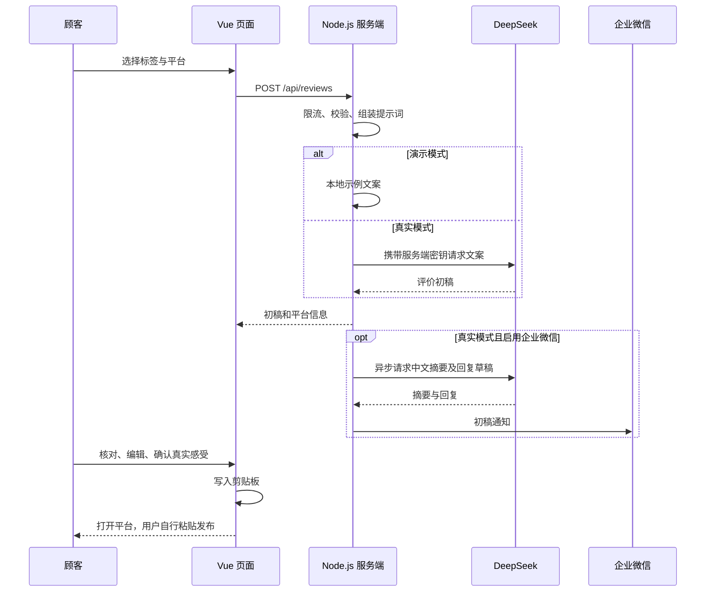

# 项目架构设计

## 一、目标与设计选择

帮助顾客把真实体验整理成可编辑的评价初稿。整个流程是“选择感受 → 生成文案 → 顾客核对 → 复制 → 用户亲自发布”。

前端使用 Vue 3 Composition API 和 Vite；样式使用普通 CSS，减少构建和换肤成本。后端使用 Node.js + Express，保护密钥、验证参数和调用 AI。没有数据库，评价不在服务端持久化保存；刷新页面会丢失本次草稿。

多语言扩展增加 `shared/languages.js`、`src/messages.js`、`src/i18n.js`。界面支持简体、繁体、英语、加拿大法语、西班牙语；评价语言独立传递到服务端。详细说明见 [多语言使用与维护](多语言使用与维护.md)。

视觉变量：奶油底色 `#f8f5ed`、深茶绿 `#234e42`、日光黄 `#f6cf75`、浅绿 `#edf0e4`、暖白 `#fffefa`。品牌英文用本地 Georgia，中文与正文用系统字体。桌面双栏分别承担“选择”和“编辑”；手机纵向排列。茶杯图形由 CSS 绘制，不依赖外部图片或字体服务。

## 二、目录职责

```text
sunny-tea-house/
├── src/
│   ├── App.vue             选择、生成、编辑、复制、状态管理
│   ├── style.css           设计变量、桌面/手机布局、键盘焦点
│   └── main.js             Vue 启动入口
├── public/sun.svg          品牌太阳图标
├── server/
│   ├── config.js           服务端配置、平台链接白名单
│   ├── reviews.js          参数校验、提示词、AI 调用、企业微信通知
│   ├── app.js              HTTP 接口、限流、静态文件与错误响应
│   └── index.js            读取配置、监听端口、启动错误处理
├── scripts/
│   ├── dev.mjs             同时启动前后端开发进程
│   └── start.ps1           检查依赖和端口、构建、启动
├── tests/
│   ├── api.test.js         后端单元和 HTTP 集成测试
│   └── e2e/review.spec.js   浏览器操作与手机布局测试
├── docs/                   架构、操作、维护和预览图
├── .env.example            可公开的配置模板
├── .env                    私有本地配置，不提交版本库
├── package-lock.json       固定实际安装的依赖版本
├── 启动项目.cmd             Windows 双击入口
└── dist/                   构建后的页面，由后端提供访问
```

## 三、请求流程



## 四、接口契约

### GET /api/health

返回 `200 { "ok": true }`，用于本地启动和部署健康检查。

### GET /api/config

返回公开店名、城市、标签、平台 URL、`demo` 和 `notificationEnabled`。不会返回 API Key 或 Webhook。

### POST /api/reviews

请求示例：

```json
{ "platform": "Google", "tags": ["服务好", "茶香浓郁"], "language": "en" }
```

响应示例：

```json
{ "content": "评价初稿", "platform": "Google", "language": "en", "demo": true }
```

错误统一为 `{ "error": "可展示给用户的中文提示" }`。主要状态码：400 参数问题，413 请求体过大，429 频率过高，502 上游响应或连接失败，504 AI 请求超时。上游 401、402 会被转换为中文配置/余额提示，避免把服务方原始响应或密钥返回给浏览器。

## 五、关键实现与修复点

1. **保护密钥**：浏览器只访问本站 `/api/reviews`。DeepSeek 的认证头在服务端组装，拆分密钥的旧做法已移除。
2. **约束输入**：最多两个不重复的白名单标签；平台仅允许 Google 和小红书。不能通过绕过按钮发送任意标签或平台。
3. **避免结果错配**：记录本次生成的平台与排序后的标签签名；当前选择不匹配时禁用复制并提示重新生成。
4. **保留用户编辑**：不在发请求前清空文本。请求成功后替换，失败时旧初稿仍可继续使用。
5. **生成时禁用输入**：避免等待期间切换参数，导致结果关联错误。
6. **控制等待**：单次 DeepSeek 调用 35 秒超时；小红书长度修正最多再调用一次；浏览器等待上限 80 秒。
7. **通知解耦**：先返回初稿，再异步完成摘要和群消息。通知失败不会把已成功生成的评价标记为失败。
8. **平台跳转**：在点击事件同步阶段预留窗口，复制成功才跳转。复制失败则关闭空窗口、选中文本；窗口被拦截时提供手动链接。
9. **避免虚构经历**：提示词禁止捏造具体饮品、价格、购买次数等标签之外的事实；最终仍需顾客核对。
10. **内容按文本呈现**：使用 textarea 和 Vue 插值，不把 AI 返回值当 HTML 执行。

## 六、上线前需要补充

- 确认真实店铺身份和 Google 评价入口；虚构示例不应对应真实商家的评价页。
- 配置 HTTPS，使跨设备访问时剪贴板 API 可以正常工作。localhost 允许本地测试。
- 默认监听 `127.0.0.1`，只允许本机访问。对外运行需在明确的服务器上配置反向代理、域名、防火墙与 `HOST`。
- 公网 AI 接口建议增加验证码、全局费用预算和更强的访问策略。当前单 IP 内存限流适合演示，不能抵御分布式调用。
- 反向代理部署时必须根据实际代理层级配置 Express `trust proxy`，不能盲目设为 `true`。
- 企业微信需要可靠送达时加入 Redis/BullMQ 或数据库队列，保存任务状态、去重 ID、失败重试与过期时间。
- 不保存评价是当前产品选择。如果增加历史记录，应先确定保存范围、期限和用户删除方式。
- 自动生成的文字仍可能不符合所选语气或事实，应保留人工确认。Google 句数由提示词控制，小红书长度另有代码检查。
